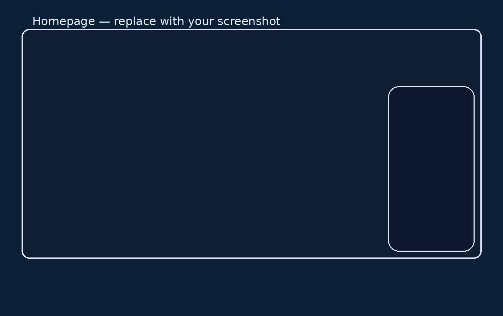
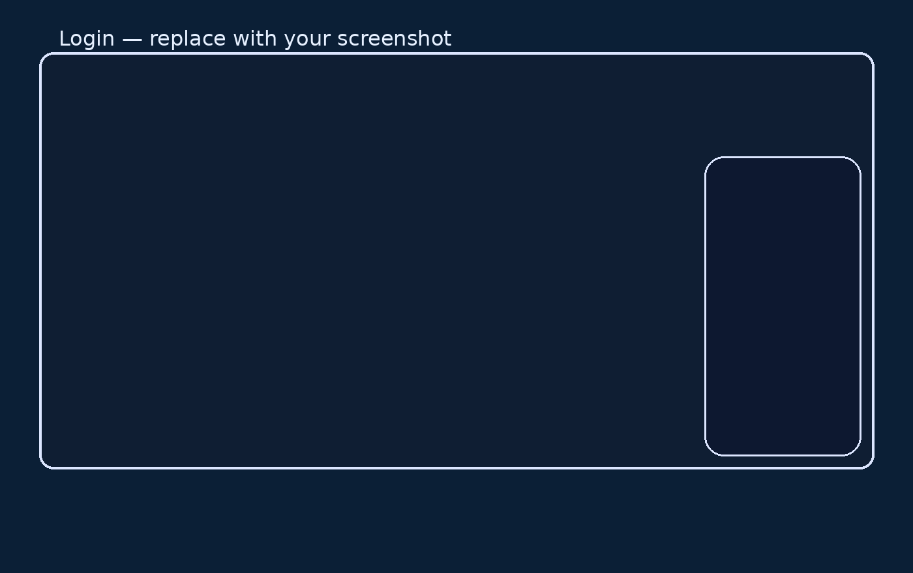

# Shoe Store E‑Commerce Website

    

> **Repo:** [FUTURE_FS_03](https://github.com/vallurudineshnayadu-create/FUTURE_FS_03)  
> **Author:** **Venkata Dinesh Valluru**  
> **Tagline:** Campus Shoes Store – Browse, Shop & Track Your Orders (educational demo; not affiliated with Campus)

A modern, mobile‑friendly shoe store built with **HTML + CSS + JavaScript** (no backend).  
Includes cart with instant updates, local accounts, **persistent orders**, and a clean gradient UI.

---

## 🔗 Live Demo
- **GitHub Pages:** `https://vallurudineshnayadu-create.github.io/FUTURE_FS_03/`  
  > Settings → Pages → Deploy from branch (`main` / root) → Save

---

## 🖼️ Screenshots — Modern Showcase
> Replace these after you run the app.






---

## 🚀 Run Locally
```bash
git clone https://github.com/vallurudineshnayadu-create/FUTURE_FS_03.git
cd FUTURE_FS_03
python -m http.server 5500
# Open http://localhost:5500
```

---

## 📝 License
Released under the **MIT License** — see [`LICENSE`](./LICENSE).
